```{=html}
<section class="cover">
  <div class="cover-logos">
    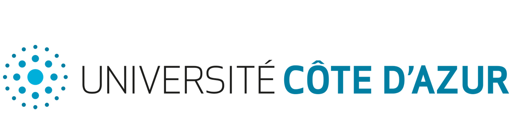
    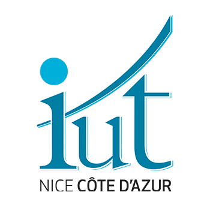
  </div>
  <div class="cover-center">
    <div class="cover-school">
      Université Côte d'Azur<br>
      IUT Nice Côte d'Azur<br>
      Département informatique<br>
      41 boulevard Napoléon III, 06206 Nice Cedex 3
    </div>
    <div class="cover-label">
      Rapport de stage pour l'obtention du Bachelor Universitaire de Technologie Informatique<br>
      Année universitaire 2025-2026
    </div>
    <div class="cover-title">
      Développement d'une application web de centralisation<br>
      et de suivi des PDF de modes dégradés
    </div>
    <div class="cover-author">
      Présenté par <strong>Maxime Giovanelli</strong><br>
      BUT2 Informatique
    </div>
    <div class="cover-company">
      
    </div>
  </div>
  <div class="cover-bottom">
    <div class="cover-meta">
      <strong>Entreprise d'accueil</strong><br>
      Centre Antoine Lacassagne<br>
      33 avenue de Valombrose, 06100 Nice<br><br>
      <strong>Période</strong><br>
      Du 15 avril au 13 juin 2026<br><br>
      <strong>Encadrement</strong><br>
      Maître de stage : Julien Degardin<br>
      Tuteur école : Olivier Pantz
    </div>
    <div class="stamp-box">
      Signature et tampon de l'entreprise<br><br>
      Scan à intégrer dans la version numérique finale
    </div>
  </div>
  <div class="cover-footer">
    Maxime Giovanelli - Stage BUT2 Informatique - Centre Antoine Lacassagne - 2025-2026
  </div>
</section>
```

<div class="page-break"></div>

# Remerciements

Merci à Julien Degardin pour l'encadrement au sein de la DSI du Centre Antoine Lacassagne, pour les retours techniques et pour les contraintes métier données dès le début du projet. Ces échanges ont cadré le périmètre: construire une application utile en situation de continuité d'activité, sans perdre de vue la sécurité des documents et des accès.

Merci également à Olivier Pantz pour le suivi pédagogique du stage, ainsi qu'aux personnes de l'IUT Nice Côte d'Azur qui ont fourni les consignes de rendu et de soutenance. Le rapport suit ces consignes: un contenu technique, des schémas, un résumé en français et un `Summary` en anglais.

<div class="page-break"></div>

# Résumé

Le stage s'est déroulé au Centre Antoine Lacassagne, au sein d'un contexte lié à la continuité d'activité informatique.<br>
Le besoin portait sur les PDF de modes dégradés utilisés lorsque des outils métier deviennent indisponibles.<br>
Ces documents peuvent être stockés sur plusieurs serveurs internes, avec des niveaux de fraîcheur difficiles à suivre manuellement.<br>
Le projet confié consistait à développer une application web capable de centraliser leur collecte et leur consultation.<br>
Le cahier des charges demandait la gestion de sources SFTP, SMB/CIFS et locales, la copie des PDF, le suivi de fraîcheur, la purge et les journaux.<br>
L'application réalisée repose sur Flask, Jinja, SQLAlchemy, SQLite, APScheduler et Docker.<br>
Le modèle de données sépare les sources, documents, utilisateurs, rôles, tokens API, journaux et jobs de fond.<br>
La synchronisation liste les fichiers d'une source, copie chaque PDF dans un fichier temporaire, calcule un hash SHA-256 puis évite les copies inutiles.<br>
Les documents collectés sont consultables dans une interface web avec filtres, tri, viewer PDF, téléchargement unitaire et export ZIP.<br>
Les opérations longues sont suivies par des jobs de fond afin de ne pas bloquer l'interface.<br>
La sécurité a demandé un traitement spécifique: sessions web, tokens Bearer pour l'API, permissions, CSRF, CSP, chiffrement Fernet et validation des chemins.<br>
Les identifiants de sources sont chiffrés et une procédure de rotation de clé est documentée.<br>
Les exports CSV/XLSX et les emails sont neutralisés pour éviter des injections moins visibles.<br>
Les tests automatisés couvrent les services principaux, les permissions, les chemins, les connecteurs mockés, la purge et plusieurs règles de configuration.<br>
Certaines exigences restent partielles ou conditionnelles: API non CRUD complet, notifications dépendantes du SMTP, LDAP configurable mais non validé sur un annuaire réel.<br>
Le résultat est une base applicative maintenable, documentée et testée, prête à être reprise pour une validation en environnement d'exploitation.

# Summary

The internship took place at Centre Antoine Lacassagne in an IT continuity context.<br>
The project focused on degraded-mode PDF documents used when usual business tools are unavailable.<br>
These files may be stored on several internal servers, making freshness and availability hard to monitor manually.<br>
The assigned work was to build a web application that centralizes collection, tracking and consultation of these PDFs.<br>
The specification required SFTP, SMB/CIFS and local sources, local copies, freshness status, purge rules and audit logs.<br>
The delivered application uses Flask, Jinja, SQLAlchemy, SQLite, APScheduler and Docker.<br>
The data model separates sources, documents, users, roles, API tokens, logs and background jobs.<br>
The synchronization process lists remote files, downloads each PDF to a temporary file, computes a SHA-256 hash and skips unchanged content.<br>
Collected documents can be browsed through a web interface with filters, sorting, an integrated PDF viewer, single download and ZIP export.<br>
Long operations are represented by background jobs so the interface can respond without waiting for the full synchronization or purge.<br>
Security required specific work: web sessions, Bearer tokens for the API, permissions, CSRF, CSP, Fernet encryption and path validation.<br>
Source credentials are encrypted, and a key rotation procedure is documented for operations.<br>
CSV/XLSX exports and email content are sanitized to avoid less obvious injection cases.<br>
Automated tests cover the main services, permissions, path confinement, mocked connectors, purge behavior and configuration rules.<br>
Some requirements remain partial or conditional: the API is not a full CRUD API, notifications depend on SMTP configuration, and LDAP is configurable but not validated against a real directory in the repository.<br>
The result is a documented and tested application base that can be continued and validated in an operational environment.

<div class="page-break"></div>

# Sommaire

1. Remerciements
2. Résumé et Summary
3. Table des figures et glossaire
4. Introduction
5. Contexte d'accueil
6. Cahier des charges et analyse
7. Outils, existant et choix techniques
8. Rapport technique
9. Manuel d'installation et d'utilisation
10. Bilan, perspectives et rapport d'activité
11. Conclusion
12. Bibliographie et sitographie
13. Annexes
14. Quatrième de couverture

# Table des figures

| N° | Figure | Fichier |
|---|---|---|
| 1 | Architecture générale de StageSarcophage | `images/schema-architecture-generale.png` |
| 2 | Modèle de données simplifié | `images/schema-modele-donnees.png` |
| 3 | Flux de synchronisation | `images/schema-flux-synchronisation.png` |
| 4 | Sécurité et accès | `images/schema-securite-acces.png` |
| 5 | Jobs de fond | `images/schema-jobs-fond.png` |
| 6 | Purge et corbeille | `images/schema-purge-corbeille.png` |
| 7 | Déploiement | `images/schema-deploiement.png` |
| 8 | Parcours utilisateur | `images/schema-parcours-utilisateur.png` |
| 9 | Planning prévu/réalisé | `images/schema-gantt-prevu-realise.png` |
| 10 | État du périmètre | `images/schema-matrice-exigences.png` |

# Glossaire

| Terme | Définition |
|---|---|
| API REST | Interface HTTP destinée aux intégrations internes. Dans ce projet, elle est exposée sous `/api/v1` et utilise des tokens Bearer. |
| Bearer token | Jeton transmis dans l'en-tête `Authorization`. Il évite d'utiliser une session web pour l'API. |
| CSRF | Attaque qui force un navigateur authentifié à envoyer une requête non voulue. Les formulaires web modifiants sont protégés. |
| Fernet | Mécanisme de chiffrement symétrique utilisé pour les identifiants de sources. |
| Mode dégradé | Procédure ou document utilisé lorsque le fonctionnement normal d'un outil métier n'est plus disponible. |
| SHA-256 | Fonction de hachage utilisée pour comparer le contenu des PDF collectés. |
| SMB/CIFS | Protocole d'accès aux partages de fichiers Windows. |
| SFTP | Protocole de transfert de fichiers au-dessus de SSH, utilisé pour les sources Linux. |
| SQLite WAL | Mode d'écriture de SQLite adapté à une application légère avec accès concurrents limités. |

<div class="page-break"></div>

# Introduction

Dans un établissement de santé, l'indisponibilité d'un outil métier ne doit pas bloquer l'accès aux procédures essentielles. Les modes dégradés répondent à ce besoin: formulaires, fiches réflexes, bons vierges et procédures papier restent disponibles même lorsque le système habituel ne l'est plus. Le cahier des charges fourni par la DSI du Centre Antoine Lacassagne décrit un problème précis: ces PDF existent, mais ils peuvent être dispersés sur plusieurs serveurs Windows et Linux, sans vue centralisée sur leur fraîcheur, leur disponibilité et leur cycle de vie.

Le projet StageSarcophage vise à réduire cette dispersion. L'application doit récupérer des PDF depuis des sources hétérogènes, les copier localement, calculer leur état de fraîcheur, permettre leur consultation rapide et tracer les opérations. Le besoin n'est pas de produire un outil documentaire général. Le périmètre est plus étroit: conserver un accès contrôlé à des documents utiles en situation perturbée, avec assez de journaux et de règles de sécurité pour que l'application puisse être exploitée sérieusement.

Le rapport présente d'abord le contexte d'accueil et le cahier des charges. Il décrit ensuite les choix techniques, puis le fonctionnement interne de l'application: architecture Flask, modèle SQLAlchemy, synchronisation, purge, sécurité, API, interface et tests. Les dernières parties donnent un manuel d'installation, un bilan des écarts et des perspectives pour une reprise du projet.

# Présentation de l'entreprise et contexte d'accueil

Le Centre Antoine Lacassagne est un centre de lutte contre le cancer situé à Nice. Dans ce rapport, la présentation se limite aux informations utiles au projet: l'application a été développée pour un contexte de DSI hospitalière, avec des contraintes de continuité, de traçabilité et de sécurité. Le site du Centre présente son activité de soins, de recherche et d'accompagnement des patients. Pour le projet, l'élément important est l'environnement informatique: les documents de modes dégradés doivent rester disponibles même lorsque les outils habituels ou certains accès réseau sont perturbés.

La DSI intervient ici comme service responsable de l'accès aux documents, de la configuration des sources et de l'exploitation de l'application. Le cahier des charges demande une application web interne, conteneurisable, configurable par variables d'environnement et capable de fonctionner avec SQLite. Cette contrainte oriente fortement la conception: il faut produire un système suffisamment simple à déployer, mais assez structuré pour gérer des accès réseau, des fichiers, des droits et des logs.

Les documents manipulés peuvent contenir des données sensibles. Le rapport ne peut pas affirmer une conformité HDS complète, car le dépôt ne prouve pas une qualification d'hébergement ni une validation juridique. En revanche, le code et la documentation montrent des mesures applicatives cohérentes avec ce contexte: chiffrement des identifiants, permissions, contrôle des chemins, headers HTTP, gestion des secrets et tests de sécurité.

# Cahier des charges et analyse du besoin

Le fichier `cahier_des_charges.md` est le document de référence. Il demande cinq blocs fonctionnels: gestion des sources, collecte des documents, contrôle de fraîcheur, purge automatique et consultation des documents. Il ajoute des exigences d'administration, de sécurité, de performance, de fiabilité et de déploiement.

La demande principale tient en une chaîne: déclarer une source, tester l'accès, synchroniser les PDF, stocker une copie locale, suivre l'âge des documents, permettre la consultation et supprimer les fichiers trop anciens selon une règle de rétention. Le besoin est opérationnel. Une personne chargée de maintenir les modes dégradés doit pouvoir savoir quels documents sont disponibles, lesquels deviennent anciens, quelles sources sont en erreur et quelles actions ont été effectuées.

| Exigence du cahier des charges | État dans le dépôt | Preuves principales |
|---|---|---|
| Sources SFTP, SMB/CIFS, locales | Livré, avec tests mockés pour les accès réseau | `app/services/sftp_service.py`, `app/services/smb_service.py`, `app/services/local_service.py`, `tests/test_sftp_service.py`, `tests/test_smb_service.py` |
| Synchronisation manuelle et planifiée | Livré | `app/services/sync_service.py`, `app/services/sync_orchestrator.py`, `app/scheduler/tasks.py` |
| Copie locale et déduplication SHA-256 | Livré | `app/services/sync_service.py` |
| Statuts de fraîcheur | Livré | `app/models/document.py`, `app/services/purge_service.py` |
| Purge automatique et manuelle | Partiel mais opérationnel: corbeille, nettoyage, journalisation | `app/services/purge_service.py`, `app/routes/sources.py` |
| Consultation web, viewer, téléchargement | Livré | `app/routes/documents.py`, `app/templates/documents/` |
| API REST | Partiel: lecture, stats, sync, jobs, téléchargement, mais pas CRUD complet | `app/routes/api.py`, `app/api/openapi.py` |
| LDAP | Optionnel et configurable, pas prouvé contre un annuaire réel | `app/services/ldap_service.py`, `tests/test_auth_ldap.py` |
| HTTPS | Prévu par configuration et reverse proxy, pas assuré par Flask seul | `docs/OPERATIONS.md`, `config.py`, `Dockerfile` |
| Performance 500 PDF en moins de 5 min | Non prouvé par benchmark dans le dépôt | Aucun test de charge équivalent |
| Sauvegarde automatique de la base | Non livrée comme tâche automatique | `docs/OPERATIONS.md` liste les éléments à sauvegarder |

La figure 1 situe l'application dans son environnement logique: utilisateur web, API, services, base SQLite, stockage local et sources documentaires.

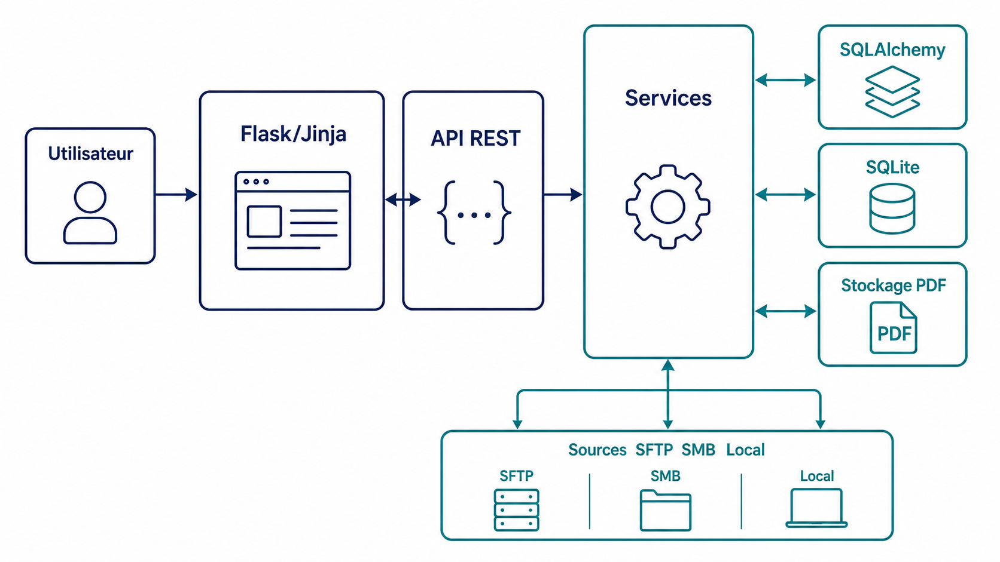

Le périmètre réellement livré couvre le cœur du besoin, mais il ne faut pas le présenter comme une solution hospitalière complète déjà validée en production. Le dépôt montre une application prête pour une phase d'essai ou de reprise technique, avec une documentation d'exploitation, des tests et un Dockerfile. Il ne montre pas une validation terrain avec vrais serveurs SFTP, SMB, LDAP et SMTP.

Le planning du stage a suivi une progression classique: analyse du besoin, socle Flask/SQLite, sources, synchronisation, interface, sécurité, tests et documentation. La figure 9 garde ce découpage en semaines S1 à S9 pour éviter d'inventer des dates intermédiaires trop précises.

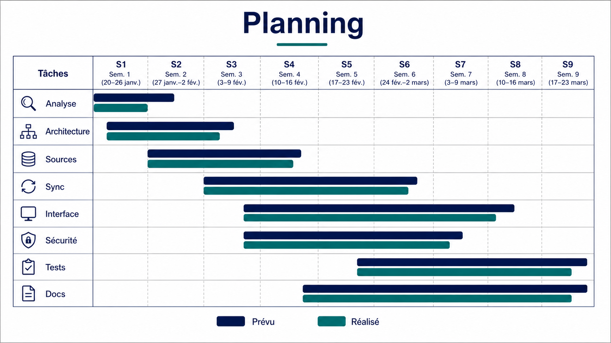

# Outils, existant et choix techniques

Le choix de Flask correspond au cahier des charges, qui cite Python/Flask comme stack proposée pour rester cohérent avec l'écosystème existant. Le dépôt confirme cette orientation: `run.py`, `app/__init__.py`, les blueprints de `app/routes/` et les templates Jinja forment une application web côté serveur. Ce choix évite un frontend JavaScript lourd et garde une architecture lisible pour un projet interne.

SQLite est utilisé avec SQLAlchemy. Ce choix simplifie le déploiement: pas de serveur de base supplémentaire à installer, sauvegarde par fichier, migrations légères. La limite est claire: ce n'est pas une architecture distribuée. Si le volume, les accès concurrents ou la haute disponibilité deviennent prioritaires, une migration PostgreSQL devra être étudiée.

Les connecteurs reposent sur des bibliothèques adaptées aux protocoles demandés: Paramiko pour SFTP, `smbprotocol` pour SMB/CIFS, et la bibliothèque standard Python pour les chemins locaux. APScheduler gère les tâches planifiées. Les jobs de fond utilisent un `ThreadPoolExecutor` interne, suffisant pour une application légère, mais différent d'une file distribuée comme Celery.

Docker et Gunicorn servent au lancement production. Le dépôt demande toutefois de placer l'application derrière un reverse proxy HTTPS. Ce point doit rester écrit comme une consigne d'exploitation, pas comme une fonctionnalité TLS implémentée par l'application elle-même.

Les alternatives non retenues peuvent être résumées simplement. Une GED complète aurait fourni plus de fonctions documentaires, mais aurait dépassé le besoin de collecte contrôlée de PDF de modes dégradés. Une application avec frontend SPA aurait augmenté la surface technique sans bénéfice évident pour les écrans demandés. Une base PostgreSQL aurait été mieux adaptée à de forts accès concurrents, mais SQLite répond au cahier des charges initial de simplicité.

# Rapport technique

## Architecture applicative

StageSarcophage est un monolithe Flask. Les routes HTTP restent responsables de l'authentification, des permissions, de la lecture des paramètres de requête et du rendu. Les traitements métier sont placés dans `app/services/`: synchronisation, purge, exports, notifications, LDAP, jobs de fond et connecteurs. Les modèles SQLAlchemy sont dans `app/models/`. Les utilitaires de sécurité sont dans `app/utils/`.

Cette séparation évite de mélanger les formulaires HTML, les accès réseau et les règles de stockage dans les mêmes fonctions. Exemple: la route de synchronisation d'une source appelle l'orchestrateur, qui crée un job, puis le service de synchronisation sélectionne le connecteur selon le protocole. Le code reste lisible parce que chaque couche manipule un niveau d'abstraction différent.

Le modèle de données, présenté figure 2, met au centre la relation entre `Source` et `Document`. Les autres tables répondent à des besoins d'exploitation: `Journal` pour les événements, `BackgroundJob` pour les opérations longues, `User`, `Role` et `APIToken` pour les accès.

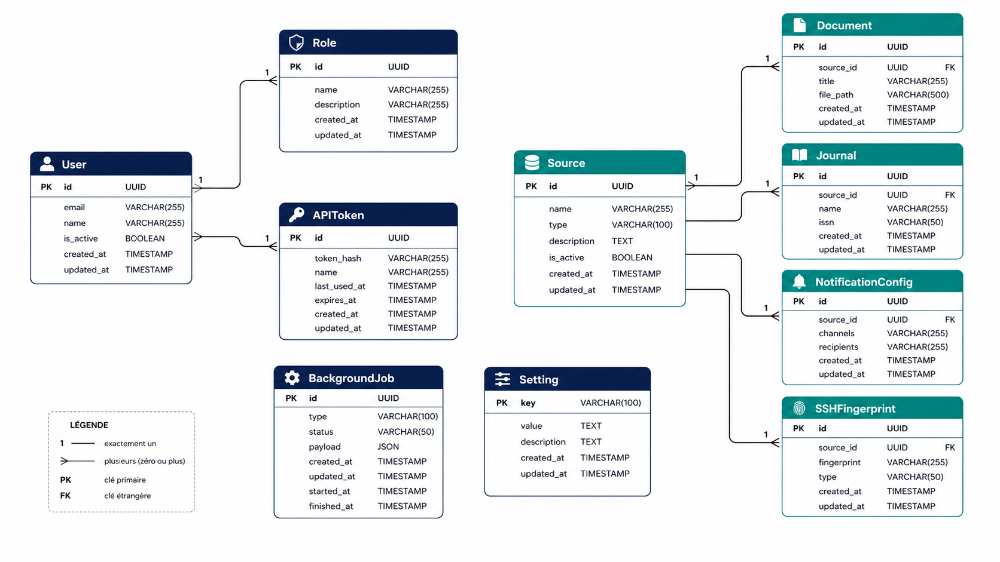

## Sources et synchronisation

Une source décrit l'origine des PDF: protocole, adresse, chemin distant, identifiants, filtre de fichiers, fréquence de synchronisation, seuils de fraîcheur et durée de rétention. Les protocoles confirmés par le code sont `sftp`, `smb` et `local`. Les identifiants sont accessibles via les propriétés `login` et `mot_de_passe` de `Source`; les colonnes physiques sont chiffrées.

Le service `app/services/sync_service.py` applique la même logique à toutes les sources. Il choisit le connecteur avec `_get_connector`, liste les fichiers distants, nettoie le nom de fichier, télécharge dans un fichier temporaire, calcule le hash SHA-256, puis remplace le fichier final seulement si le contenu a changé. Cette étape temporaire limite le risque de fichier partiellement écrit.

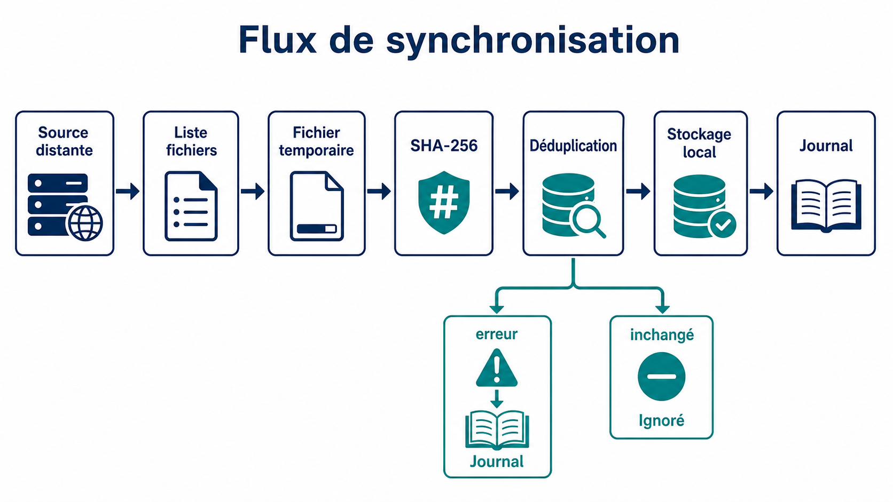

La difficulté principale de cette partie vient des chemins. Un nom distant ne peut pas être utilisé tel quel. Un fichier appelé `../secret.pdf` doit être refusé ou neutralisé, que la source soit locale, SFTP ou SMB. La validation ne concerne pas seulement la synchronisation: le même problème revient au téléchargement, au ZIP, à la purge et à la restauration depuis la corbeille. Le dépôt traite ce point dans `app/utils/files.py`, `app/services/sync_service.py`, `app/routes/documents.py` et `app/services/purge_service.py`.

Les tests réseau ne se connectent pas à de vrais serveurs. Ce choix est volontaire: les tests doivent rester reproductibles sur un poste de développement ou dans une intégration continue. Les connecteurs SFTP et SMB sont donc testés avec mocks. Le rapport doit le dire clairement. Les tests prouvent la logique d'appel, de filtrage et de gestion d'erreur; ils ne prouvent pas une compatibilité exhaustive avec chaque serveur réel.

## Fraîcheur, purge et corbeille

Chaque document porte une date de modification source, une date de collecte, une taille, un hash et un statut. Les statuts sont définis dans `app/models/document.py`: `ok`, `avertissement`, `critique`, `purge`. Le service `app/services/purge_service.py` met à jour les statuts selon les seuils configurés sur la source.

La purge ne supprime pas immédiatement le fichier. Elle déplace le document expiré vers `_corbeille`, marque le document en `PURGE`, puis laisse un nettoyage définitif supprimer les fichiers de corbeille après une période de rétention. Cette approche limite les erreurs irréversibles. Elle correspond mieux à un contexte interne qu'une suppression directe.

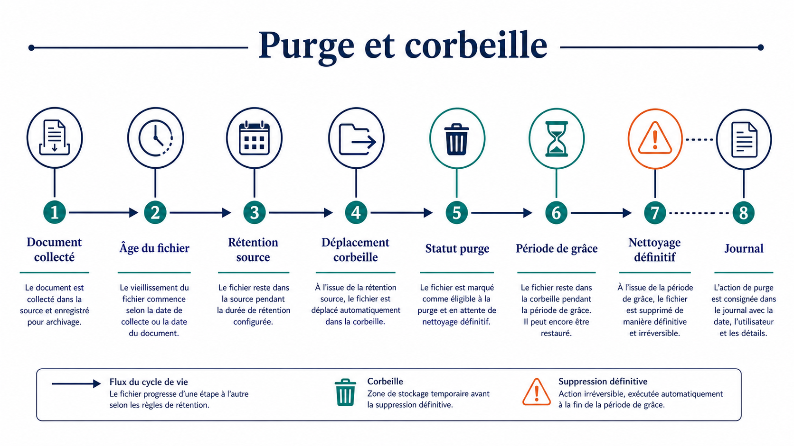

La purge est classée partielle dans la matrice, car le cahier des charges mentionne des politiques paramétrables et une grâce optionnelle. Le dépôt contient une corbeille et une configuration `CORBEILLE_RETENTION_JOURS`, mais toutes les variantes métier possibles ne sont pas démontrées par des scénarios d'exploitation.

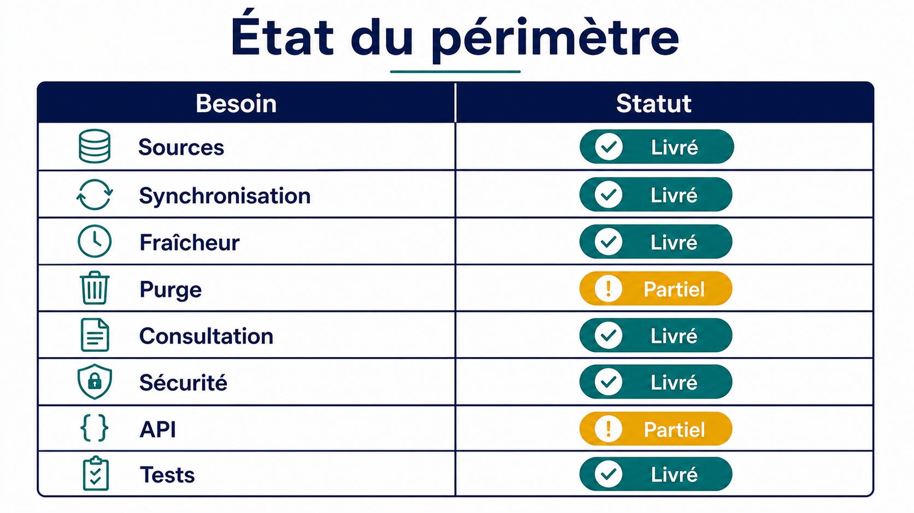

## Jobs de fond

Les synchronisations et purges peuvent prendre du temps. L'application évite de bloquer la réponse HTTP en créant des `BackgroundJob`. Le service `app/services/job_service.py` crée une ligne en base, exécute le traitement en ligne si `JOBS_RUN_INLINE` est actif, ou dans un pool de threads sinon. L'API peut ensuite renvoyer le statut d'un job.

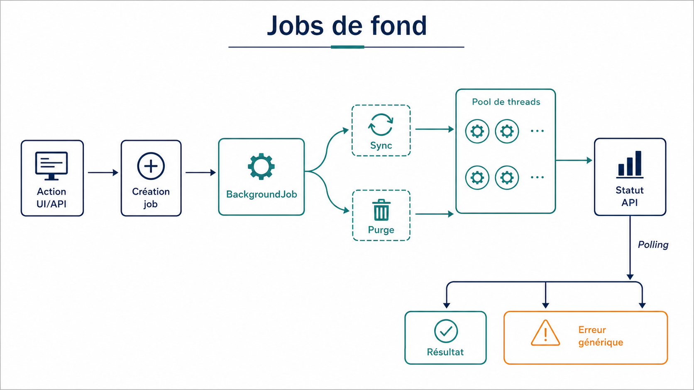

Cette solution reste interne au processus Flask. Elle suffit pour une application légère, mais elle n'a pas les garanties d'une file distribuée. Un redémarrage du processus pendant un job peut nécessiter un traitement manuel ou une relance. Cette limite est acceptable dans le périmètre actuel si elle est connue par l'exploitant.

Le mode `JOBS_RUN_INLINE` est utile pour les tests. Il rend l'exécution déterministe: le test reçoit un job déjà exécuté au lieu d'attendre un thread. Cette différence entre production et test a demandé de faire attention aux assertions sur les statuts.

## Interface web et parcours utilisateur

L'interface est rendue côté serveur avec Jinja et Bootstrap. Le parcours principal est simple: connexion, tableau de bord, gestion d'une source, test de connexion, synchronisation, consultation des documents, téléchargement et lecture des journaux. Les pages d'administration couvrent les utilisateurs, rôles, tokens, notifications, LDAP et paramètres.

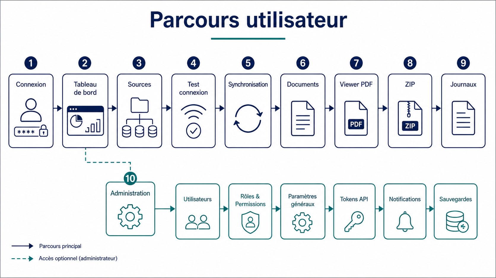

La page Documents filtre par source, statut et recherche texte. Elle permet aussi le tri, la pagination, le viewer PDF, le téléchargement unitaire et le ZIP. Le ZIP est limité pour éviter une archive trop lourde: `app/routes/documents.py` contient une limite de 100 documents et 500 Mo. Ce genre de limite n'est pas décoratif; il protège le serveur contre une action trop coûteuse lancée depuis l'interface.

Les templates contiennent aussi des éléments d'accessibilité de base: lien d'évitement, cible `main`, labels, scopes de tables et noms accessibles sur les actions. Ce n'est pas un audit WCAG complet, mais ce travail évite les oublis les plus visibles sur une console interne.

## Sécurité

La sécurité de StageSarcophage repose sur plusieurs couches. L'interface web utilise Flask-Login et des sessions. L'API utilise des tokens Bearer stockés hachés en base. Les routes sensibles vérifient des permissions, pas seulement un rôle nommé administrateur. Les formulaires web modifiants sont protégés par CSRF.

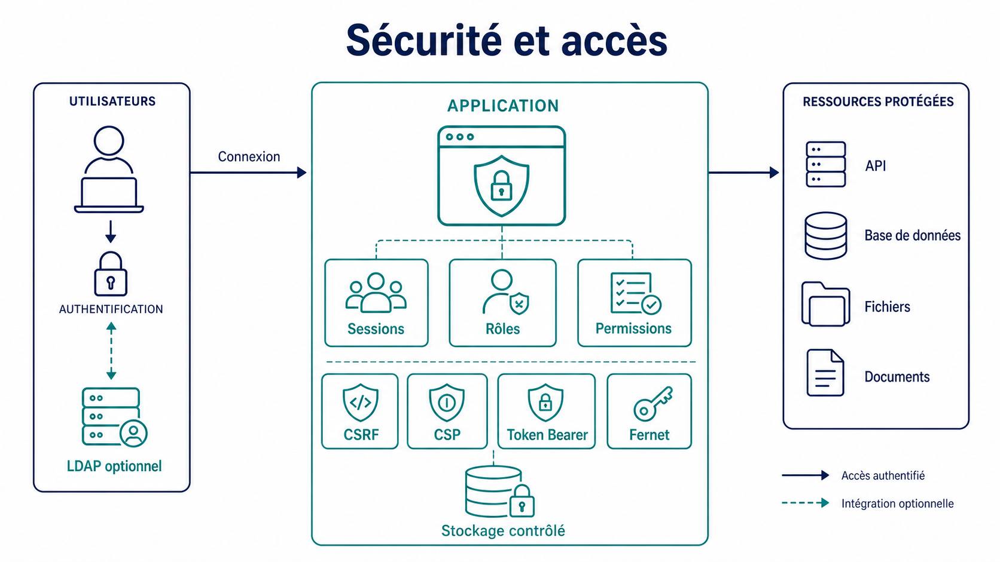

Les secrets sont contrôlés au démarrage. En production, `SECRET_KEY` et `ENCRYPTION_KEY` sont requis. Les identifiants des sources sont chiffrés avec Fernet dans `app/models/source.py` et `app/utils/crypto.py`. Le dépôt contient aussi un service de rotation: `app/services/encryption_rotation_service.py`. Cette rotation est importante, car remplacer une clé Fernet sans ré-encrypter les données rendrait les identifiants illisibles.

Les chemins sont confinés au stockage contrôlé avec `realpath` et `commonpath`. Cette règle est plus solide qu'un simple remplacement de `../`, car elle tient compte des chemins absolus et des liens symboliques. Elle protège les téléchargements, le ZIP, la purge et la restauration.

Les exports CSV/XLSX neutralisent les valeurs qui pourraient être interprétées comme formules tableur. Les notifications et rapports échappent les contenus HTML. Ce point est facile à manquer, car il ne ressemble pas à une injection SQL classique. Les tests `tests/test_exports_sanitization.py` couvrent ces cas.

La CSP et les headers HTTP sont posés dans `app/__init__.py`: `nosniff`, `SAMEORIGIN`, politique de referrer, permissions policy et nonce sur les scripts. HTTPS reste une contrainte de déploiement derrière reverse proxy. L'application peut forcer HTTPS selon configuration, mais elle ne remplace pas une terminaison TLS correctement administrée.

## API REST

L'API v1 est définie dans `app/routes/api.py`. Elle expose un healthcheck public, des statistiques, la liste des sources, le détail d'une source, le déclenchement d'une synchronisation, le statut d'un job, la liste des documents, le détail d'un document et le téléchargement. La documentation OpenAPI est placée dans `app/api/openapi.py`.

L'API n'est pas un CRUD complet. Elle sert surtout à consulter l'état et à déclencher des opérations. La création, modification et suppression de sources restent dans l'interface web. Cette limite est saine pour le périmètre actuel: exposer un CRUD complet demanderait plus de validations, plus de tests et une politique d'autorisation plus fine.

La difficulté technique vient du double modèle d'accès. Un utilisateur web passe par une session et CSRF; un client API passe par token Bearer. Les deux doivent aboutir aux mêmes permissions métier. Les tests `tests/test_api_permissions.py` vérifient que les tokens ne contournent pas les droits.

## Déploiement et exploitation

Le dépôt fournit un Dockerfile, un `docker-compose.yml`, un `entrypoint.sh` et des commandes Flask pour initialiser ou migrer la base. Le lancement production passe par Gunicorn dans le conteneur. La documentation d'exploitation demande de sauvegarder la base SQLite, le stockage PDF, le fichier `.env` et les logs si l'historique est nécessaire.

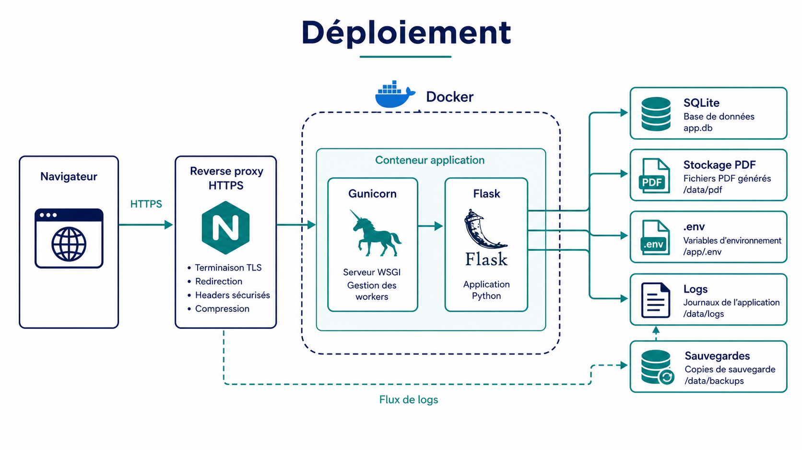

Les variables minimales sont `SECRET_KEY`, `ENCRYPTION_KEY`, `STORAGE_DIR` et `FLASK_ENV=production`. D'autres variables contrôlent les jobs, les racines locales autorisées, LDAP, HTTPS et le proxy. Le fichier `.env` doit rester ignoré par Git et avoir des permissions restrictives. La commande `make permissions` vérifie ce point.

SQLite simplifie la mise en route, mais impose une discipline d'exploitation: sauvegarde régulière, surveillance de la taille de base, prudence sur les accès concurrents et plan de migration si le volume augmente.

## Tests et qualité

La commande centrale est `make check`. Elle lance Ruff sur les erreurs Python critiques, pytest avec couverture, Bandit, `pip-audit`, un scan de secrets suivis par Git et un contrôle des permissions du fichier `.env`. Les tests couvrent les modèles, la synchronisation, la purge, les sources, les permissions, la sécurité, LDAP, SFTP, SMB, les exports, les notifications et les templates.

Les tests utilisent SQLite en mémoire et un stockage temporaire. Cette stratégie rend les tests rapides et isolés. Elle impose toutefois de bien recréer les tables et de maîtriser les fixtures Flask/SQLAlchemy. Pour un niveau BUT2, cette partie est une difficulté réelle: il faut comprendre l'application factory, le contexte Flask, la session SQLAlchemy et la différence entre test unitaire et test d'intégration léger.

Les commandes ciblées documentées dans `docs/TESTING.md` permettent d'éviter de relancer toute la suite pendant chaque modification:

```bash
.venv/bin/python -m pytest tests/test_api_permissions.py -q
.venv/bin/python -m pytest tests/test_sync_service.py tests/test_purge_service.py -q
.venv/bin/python -m pytest tests/test_config_security.py tests/test_encryption_rotation.py -q
make check
```

Le dépôt ne contient pas de benchmark prouvant la synchronisation de 500 PDF en moins de 5 minutes. Cette exigence doit donc rester à valider. Le même principe vaut pour LDAP, SMTP, SFTP et SMB contre de vrais serveurs: les mocks prouvent la logique applicative, pas tous les comportements d'infrastructure.

# Manuel d'installation et d'utilisation

## Installation locale

Créer l'environnement Python et installer les dépendances:

```bash
python3 -m venv .venv
.venv/bin/pip install -r requirements-dev.txt
```

Créer le fichier `.env` depuis l'exemple, puis définir les valeurs minimales:

```bash
cp .env.example .env
SECRET_KEY=...
ENCRYPTION_KEY=...
STORAGE_DIR=/chemin/vers/le/dossier/data
FLASK_ENV=development
```

Les clés peuvent être générées avec:

```bash
python3 -c "import secrets; print(secrets.token_hex(32))"
.venv/bin/python -c "from cryptography.fernet import Fernet; print(Fernet.generate_key().decode())"
```

Initialiser la base et créer un administrateur:

```bash
set -a
. ./.env
set +a
.venv/bin/flask --app run.py init-db
.venv/bin/flask --app run.py create-admin --username admin --password admin12345
```

Lancer le serveur:

```bash
.venv/bin/flask --app run.py run --host 0.0.0.0 --port 5000
```

L'application est ensuite accessible sur `http://127.0.0.1:5000/login`.

## Lancement Docker

Le dépôt documente le lancement suivant:

```bash
docker compose build
docker compose up -d
docker compose exec web flask init-db
docker compose exec web flask create-admin --username admin --password admin12345
docker compose logs -f web
```

En production, l'application doit être placée derrière un reverse proxy HTTPS. Les variables `FORCE_HTTPS`, `TRUST_PROXY` et `SESSION_COOKIE_SECURE` doivent correspondre à la façon dont TLS est terminé.

## Parcours utilisateur

Le parcours de test fonctionnel est le suivant:

1. Se connecter avec un compte administrateur.
2. Aller dans `Sources`.
3. Créer une source SFTP, SMB ou locale.
4. Tester la connexion.
5. Lancer une synchronisation.
6. Aller dans `Documents`.
7. Vérifier les filtres, le tri, la pagination et les statuts.
8. Ouvrir un PDF dans le viewer.
9. Télécharger un PDF ou un ZIP.
10. Aller dans `Journaux` pour vérifier les événements.
11. Aller dans `Administration` pour gérer utilisateurs, rôles, tokens et notifications.

## Exploitation

Les éléments à sauvegarder sont la base SQLite, le dossier de stockage PDF, le fichier `.env` et les logs si l'historique technique doit être conservé. La rotation Fernet se fait avec:

```bash
OLD_ENCRYPTION_KEY=... NEW_ENCRYPTION_KEY=... .venv/bin/flask --app run.py rotate-encryption-key
```

Le fichier `.env` doit être protégé:

```bash
chmod 600 .env
make permissions
```

# Bilan, perspectives et rapport d'activité

Le travail réalisé couvre le cœur du cahier des charges: sources, synchronisation, consultation, purge, statuts, journaux, rôles, API, tests et documentation. Les parties les plus longues n'ont pas été les écrans, mais les règles qui empêchent un cas limite de devenir un problème: noms de fichiers dangereux, chemins hors stockage, erreurs publiques trop détaillées, exports tableur, droits API et rotation de clé.

La première difficulté a été de garder une architecture simple sans tout placer dans les routes Flask. Les services ont servi de frontière: `sync_service` pour la copie et le hash, `purge_service` pour la rétention, `job_service` pour les opérations longues, `notification_service` pour les alertes. Cette séparation rend le projet plus facile à reprendre.

La deuxième difficulté a été de tester des protocoles sans disposer d'une infrastructure complète. SFTP, SMB, LDAP et SMTP ne peuvent pas dépendre de serveurs réels dans la suite de tests. Les mocks ont permis de tester les scénarios nominaux, les erreurs, les timeouts et les entrées dangereuses. La limite reste assumée: une recette technique sur serveurs réels devra compléter ces tests.

La troisième difficulté a concerné la sécurité des fichiers. Un PDF est un fichier local après collecte, mais son nom vient d'un système externe. Il faut donc le traiter comme une entrée non fiable. Cette règle se retrouve dans la synchronisation, la consultation, le ZIP, la purge et la corbeille. Les tests de `tests/test_documents_security.py`, `tests/test_security.py` et `tests/test_purge_service.py` servent de garde-fou.

La quatrième difficulté a été de faire cohabiter l'interface web et l'API. Une session Flask avec CSRF ne fonctionne pas comme un token Bearer. Le risque aurait été de sécuriser l'interface mais de laisser l'API déclencher les mêmes actions avec moins de contrôle. Les décorateurs de permissions et les tests API évitent ce décalage.

Les perspectives directes sont les suivantes:

| Perspective | Intérêt | Condition avant réalisation |
|---|---|---|
| Recette avec vrais serveurs SFTP/SMB/LDAP/SMTP | Vérifier les connecteurs hors mocks | Environnement de test fourni par la DSI |
| Benchmarks de synchronisation | Valider l'exigence 500 PDF en moins de 5 minutes | Jeu de fichiers représentatif et métriques |
| API CRUD partielle sur les sources | Permettre l'administration par intégration interne | Schéma d'autorisation et validations plus stricts |
| Migration PostgreSQL optionnelle | Préparer plus de volume et d'accès concurrents | Besoin d'exploitation confirmé |
| Sauvegarde automatique | Réduire le risque d'oubli manuel | Politique de sauvegarde validée |
| Audit sécurité externe | Vérifier les contrôles avant production sensible | Périmètre et environnement figés |

Les pistes comme OCR, PWA, versioning documentaire, S3, WebDAV ou FTP ne sont pas livrées. Elles peuvent être étudiées plus tard si le besoin change, mais elles ne doivent pas être mélangées avec l'état actuel.

# Conclusion

StageSarcophage répond au besoin principal du cahier des charges: centraliser des PDF de modes dégradés, suivre leur fraîcheur et permettre leur consultation via une application web interne. Le projet repose sur une architecture Flask simple, une base SQLite, des services séparés et des connecteurs SFTP, SMB/CIFS et locaux.

Le travail technique a surtout porté sur les points qui rendent l'application exploitable: copie temporaire, hash SHA-256, statuts, purge avec corbeille, jobs de fond, permissions, chiffrement Fernet, contrôle des chemins, exports neutralisés et tests automatisés. Ces choix ne transforment pas l'application en système distribué ni en produit fini validé en production, mais ils donnent une base cohérente pour une reprise par la DSI.

La suite logique est une recette en environnement réel: vrais partages SMB, serveur SFTP, annuaire LDAP, SMTP, reverse proxy HTTPS et jeu de PDF représentatif. Cette étape permettra de mesurer les performances, d'ajuster les paramètres de rétention et de décider si SQLite reste suffisant ou si une migration de base devient nécessaire.

# Bibliographie et sitographie

## Sources internes du dépôt

- `cahier_des_charges.md`, document de référence fourni par la DSI du CLCC.
- `README.md`, lancement, technologies et fonctionnalités principales.
- `docs/ARCHITECTURE.md`, organisation applicative et invariants.
- `docs/DATA_MODEL.md`, responsabilités des entités.
- `docs/SECURITY.md`, secrets, Fernet, CSP, permissions et exploitation sécurité.
- `docs/OPERATIONS.md`, initialisation, sauvegarde, jobs et dépannage.
- `docs/TESTING.md`, stratégie de test et commandes.
- `docs/IMPLEMENTATION_STATUS.md`, état livré de la vague qualité.
- `app/services/sync_service.py`, logique de synchronisation.
- `app/services/purge_service.py`, fraîcheur, purge et corbeille.
- `app/routes/api.py`, API REST v1.
- `tests/`, suite de tests automatisés.

## Sources web utilisées

- Université Côte d'Azur, page officielle des logos: <https://univ-cotedazur.fr/universite/communication-et-marque/nos-logos>
- IUT Nice Côte d'Azur: <https://iut.univ-cotedazur.fr/>
- Département BUT Informatique Université Côte d'Azur: <https://butinfo.univ-cotedazur.fr/>
- Centre Antoine Lacassagne: <https://www.centreantoinelacassagne.org/>
- Fiche Unicancer du Centre Antoine Lacassagne: <https://www.unicancer.fr/fr/clcc/centre-antoine-lacassagne/>
- Documentation Flask: <https://flask.palletsprojects.com/>
- Documentation SQLAlchemy: <https://docs.sqlalchemy.org/>
- Documentation Paramiko: <https://www.paramiko.org/>
- Documentation APScheduler: <https://apscheduler.readthedocs.io/>

<div class="page-break"></div>

# Annexes

## Annexe A - Commandes de vérification

```bash
make check
make test
make security
make audit
make secrets
make permissions
git diff --check
```

## Annexe B - Fonctions à surveiller lors d'une reprise

| Sujet | Fichiers |
|---|---|
| Synchronisation | `app/services/sync_service.py`, `app/services/sync_orchestrator.py` |
| Connecteurs | `app/services/sftp_service.py`, `app/services/smb_service.py`, `app/services/local_service.py` |
| Purge | `app/services/purge_service.py`, `app/routes/sources.py` |
| Documents | `app/routes/documents.py`, `app/templates/documents/` |
| API | `app/routes/api.py`, `app/api/openapi.py` |
| Sécurité | `app/__init__.py`, `app/utils/files.py`, `app/utils/sanitization.py`, `app/utils/decorators.py` |
| Chiffrement | `app/utils/crypto.py`, `app/services/encryption_rotation_service.py` |
| Tests | `tests/test_security.py`, `tests/test_api_permissions.py`, `tests/test_sync_service.py`, `tests/test_purge_service.py` |

## Annexe C - Règles de remise

Le rendu numérique doit inclure le scan de la première page signée et tamponnée par l'entreprise. Il doit être envoyé à l'enseignant référent IUT, au responsable des stages M. Erol Acundeger, au tuteur entreprise, au président du jury, puis déposé dans Moodle section `Documents`. Une version papier doit être remise le jour de la soutenance. Un rendu après la date limite entraîne une pénalité de 2 points sur la note du rapport.

<div class="page-break"></div>

# Quatrième de couverture

Ce rapport présente le développement de StageSarcophage, une application web Flask destinée à centraliser des PDF de modes dégradés pour un contexte de continuité d'activité. Le projet répond à un besoin concret: récupérer des documents depuis des sources SFTP, SMB/CIFS ou locales, conserver une copie locale, suivre leur fraîcheur, permettre leur consultation et tracer les opérations.

Le cœur technique repose sur Flask, Jinja, SQLAlchemy, SQLite, APScheduler, Docker et une suite de tests pytest. Le rapport détaille les choix d'architecture, le modèle de données, la synchronisation, la purge, les jobs de fond, les contrôles de sécurité, l'API REST et les limites connues.

<div class="keywords">
  <strong>Mots-clés :</strong> Flask, PDF, modes dégradés, SFTP, SMB/CIFS, SQLite, sécurité, synchronisation, purge, continuité d'activité.
</div>

<div class="keywords">
  <strong>Keywords:</strong> Flask, PDF, degraded mode, SFTP, SMB/CIFS, SQLite, security, synchronization, purge, business continuity.
</div>
