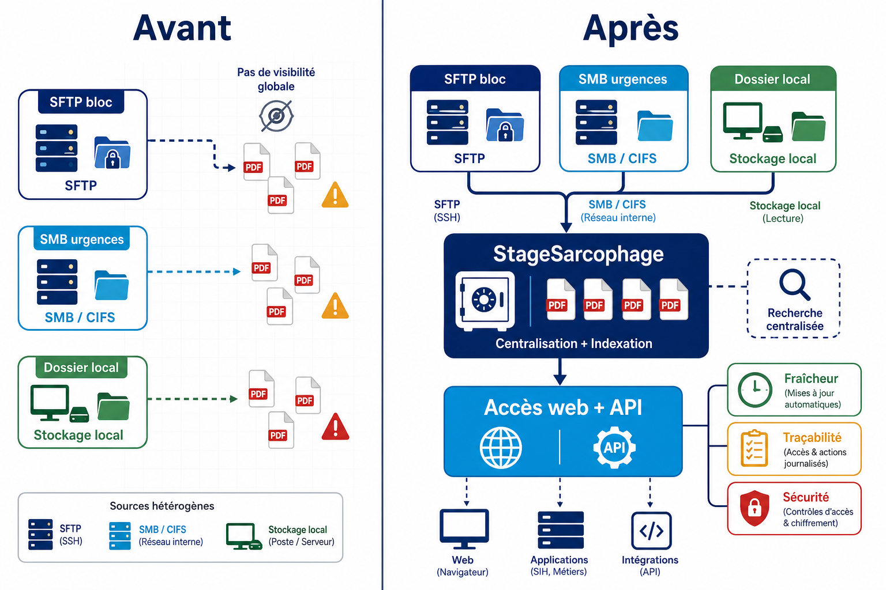
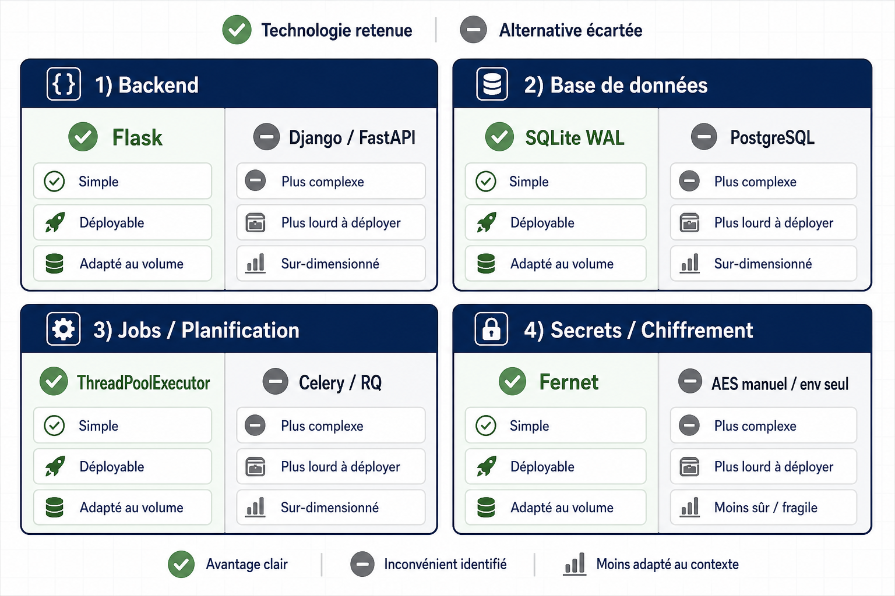
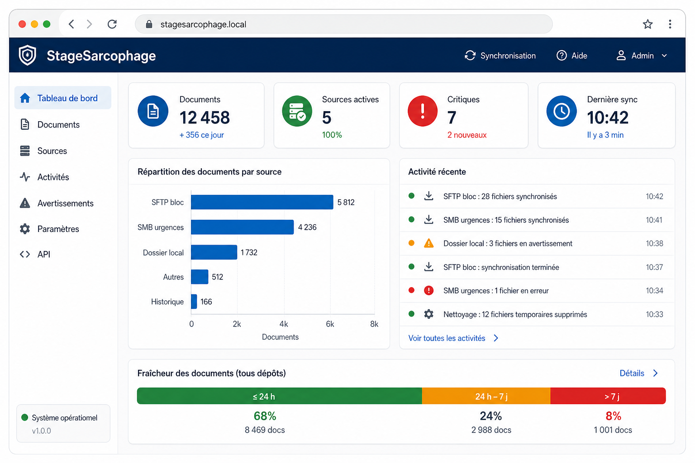
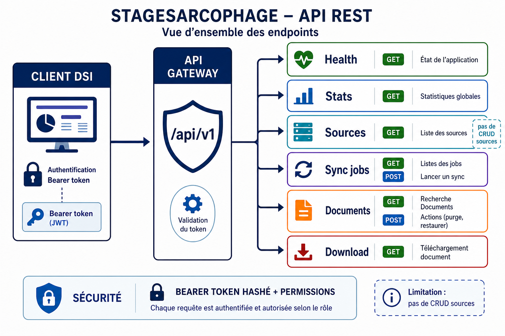
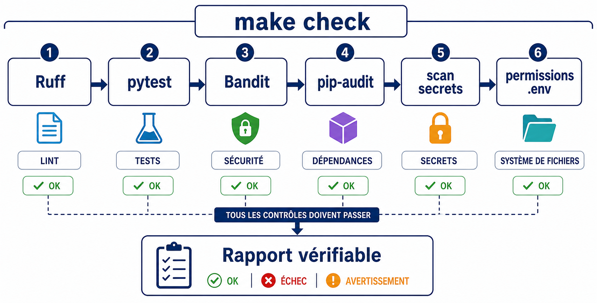

```{=html}
<section class="cover">
  <div class="cover-logos">
    
    
  </div>
  <div class="cover-center">
    <div class="cover-school">
      Université Côte d'Azur<br>
      IUT Nice Côte d'Azur<br>
      Département informatique<br>
      41 boulevard Napoléon III, 06206 Nice Cedex 3
    </div>
    <div class="cover-label">
      Rapport de stage pour l'obtention du Bachelor Universitaire de Technologie Informatique<br>
      Année universitaire 2025-2026
    </div>
    <div class="cover-title">
      Développement d'une application web de centralisation<br>
      et de suivi des PDF de modes dégradés
    </div>
    <div class="cover-author">
      Présenté par <strong>Maxime Giovanelli</strong><br>
      BUT2 Informatique
    </div>
    <div class="cover-company">
      
    </div>
  </div>
  <div class="cover-bottom">
    <div class="cover-meta">
      <strong>Entreprise d'accueil</strong><br>
      Centre Antoine Lacassagne<br>
      33 avenue de Valombrose, 06100 Nice<br><br>
      <strong>Période</strong><br>
      Du 15 avril au 13 juin 2026<br><br>
      <strong>Encadrement</strong><br>
      Maître de stage : Julien Degardin<br>
      Tuteur école : Olivier Pantz
    </div>
    <div class="stamp-box">
      Signature et tampon de l'entreprise<br><br>
      Scan à intégrer dans la version numérique finale
    </div>
  </div>
  <div class="cover-footer">
    Maxime Giovanelli - Stage BUT2 Informatique - Centre Antoine Lacassagne - 2025-2026
  </div>
</section>
```

<div class="page-break"></div>

# Remerciements

Je remercie Julien Degardin, responsable au sein de la DSI du Centre Antoine Lacassagne, pour son encadrement pendant ces huit semaines. Ses retours techniques et sa formulation claire du besoin métier ont aidé à garder un périmètre compatible avec les contraintes réelles d'exploitation hospitalière.

Je remercie également Olivier Pantz, tuteur pédagogique à l'IUT Nice Côte d'Azur, pour le suivi du stage et les conseils méthodologiques, ainsi que l'ensemble de l'équipe de la DSI pour son accueil et pour les échanges qui m'ont permis de comprendre le fonctionnement informatique de l'établissement.

<div class="page-break"></div>

# Résumé

Ce rapport présente un stage de huit semaines réalisé au Centre Antoine Lacassagne, centre de lutte contre le cancer situé à Nice, au sein de la Direction des Systèmes d'Information (DSI).

Le besoin portait sur la continuité d'activité. Quand un outil métier devient indisponible, les équipes soignantes et administratives doivent retrouver rapidement des documents PDF de modes dégradés : formulaires, procédures et fiches réflexes. Avant le projet, ces documents étaient répartis sur plusieurs stockages hétérogènes (SFTP, SMB/CIFS, dossier local). Or, aucun outil ne donnait à la DSI une vue centralisée ni un contrôle simple de leur fraîcheur.

La problématique du stage était donc la suivante : comment centraliser et fiabiliser l'accès à ces documents critiques, tout en répondant à des exigences parfois contradictoires — fraîcheur documentaire garantie, traçabilité complète des accès, et sécurité adaptée à un environnement HDS ?

Pour y répondre, le travail a d'abord porté sur l'analyse du cahier des charges et des contraintes HDS, avant de progresser vers la conception de l'architecture Flask/SQLite, le développement itératif des fonctionnalités (sources, synchronisation, interface, sécurité, API, tests), puis la rédaction de la documentation d'exploitation.

L'application livrée, nommée StageSarcophage, utilise Flask, Jinja, SQLAlchemy, SQLite, APScheduler et Docker. Elle collecte les PDF depuis trois types de sources, calcule un état de fraîcheur par document, fournit une interface web avec viewer PDF, gère une purge progressive avec corbeille et expose une API REST. Les opérations sont journalisées ; les contrôles de sécurité couvrent les sessions, les tokens Bearer, le CSRF, la CSP, le chiffrement Fernet des identifiants et le confinement des chemins — autant d'exigences directement issues du contexte HDS.

Le livrable est une base applicative documentée, testée et conteneurisable. Il reste à la valider sur l'infrastructure réelle de la DSI.

# Summary

This report presents an eight-week internship at Centre Antoine Lacassagne, a cancer treatment center in Nice, within its IT department (DSI).

The project came from a business continuity need. When standard tools become unavailable, medical and administrative staff need quick access to degraded-mode PDF documents: forms, procedures and reference sheets. Before the project, these documents were spread across heterogeneous servers (SFTP, SMB/CIFS, local storage), with no central tool to track freshness or availability.

The main question was: how can access to these critical documents be centralized and secured while keeping freshness tracking, auditability and access control compatible with HDS requirements?

The work followed four phases: requirements and HDS constraints analysis; Flask/SQLite architecture design; iterative development (sources, synchronization, interface, security, API, tests); and operational documentation.

The delivered application, StageSarcophage, uses Flask, Jinja, SQLAlchemy, SQLite, APScheduler and Docker. It collects PDFs from three source types, computes a freshness status for each document, provides a web interface with an integrated PDF viewer, manages progressive purge with a trash bin, exposes a REST API and logs operations. Security controls cover sessions, Bearer tokens, CSRF, CSP, Fernet credential encryption and path confinement.

The result is a documented, tested and containerizable application base. The DSI still has to validate it on real infrastructure before production use.

<div class="page-break"></div>

# Sommaire

1. Remerciements
2. Résumé et Summary
3. Table des illustrations et glossaire
4. Introduction
5. Partie I : Analyse de la situation
   - I.1 Présentation du Centre Antoine Lacassagne
   - I.2 Service DSI et contraintes HDS
   - I.3 Analyse des besoins
   - I.4 Cahier des charges et matrice des exigences
6. Partie II : Conception et réalisation
   - II.1 Choix technologiques et argumentation
   - II.2 Architecture applicative
   - II.3 Sources et synchronisation
   - II.4 Fraîcheur, purge et corbeille
   - II.5 Interface web et parcours utilisateur
   - II.6 API REST
   - II.7 Sécurité
   - II.8 Tests et qualité
   - II.9 Déploiement et exploitation
7. Partie III : Bilan et perspectives
   - III.1 Résultats obtenus
   - III.2 Perspectives et évolutions
8. Accompagnement du CSU lors des interventions
   - Types d'interventions
   - Notions abordées
   - Environnement informatique hospitalier
   - Continuité de service en milieu hospitalier
   - Relation avec les utilisateurs hospitaliers
9. Difficultés rencontrées
10. Conclusion
11. Bibliographie et sitographie
12. Annexes
13. Table des illustrations

# Table des illustrations

1. Situation avant et après StageSarcophage
2. Architecture applicative (couches Flask)
3. Modèle de données : entités et relations
4. Flux de synchronisation d'un document PDF
5. Interface : tableau de bord
6. Cycle de vie d'un document et purge
7. Architecture de sécurité
8. Architecture de déploiement
9. Analyse comparative des choix technologiques
10. Vue d'ensemble de l'API REST
11. Planning prévisionnel et réalisé
12. Pipeline de qualité `make check`

# Glossaire

**API REST** : interface HTTP exposée sous `/api/v1`, utilisant des tokens Bearer pour l'authentification.

**APScheduler** : bibliothèque Python de planification de tâches périodiques, utilisée pour déclencher les synchronisations automatiques.

**Bearer token** : jeton transmis dans l'en-tête `Authorization`, permettant l'accès programmatique à l'API sans session web.

**CSRF** : Cross-Site Request Forgery : attaque forçant un navigateur authentifié à envoyer une requête non voulue. Les formulaires modifiants sont protégés par un jeton CSRF.

**CSP** : Content Security Policy : en-tête HTTP limitant les ressources chargées par le navigateur, ce qui réduit la surface d'attaque XSS.

**DSI** : Direction des Systèmes d'Information du Centre Antoine Lacassagne.

**Fernet** : schéma de chiffrement symétrique authentifié (AES-128-CBC + HMAC-SHA256), utilisé pour chiffrer les identifiants des sources en base.

**GED** : Gestion Électronique de Documents : système dédié au cycle de vie documentaire complet. StageSarcophage n'est pas une GED ; il cible uniquement la collecte et la consultation des PDF de modes dégradés.

**HDS** : Hébergeur de Données de Santé : certification française encadrant l'hébergement de données médicales.

**Mode dégradé** : procédure ou document utilisé lorsque le fonctionnement normal d'un outil métier n'est plus disponible.

**RBAC** : Role-Based Access Control : les droits sont attribués à des rôles, eux-mêmes assignés aux utilisateurs.

**SHA-256** : fonction de hachage cryptographique, utilisée pour détecter les fichiers inchangés et éviter les copies inutiles.

**SFTP** : SSH File Transfer Protocol : transfert de fichiers sécurisé via SSH, utilisé pour les sources Linux.

**SMB/CIFS** : Server Message Block / Common Internet File System : protocole d'accès aux partages de fichiers Windows.

**SQLite WAL** : Write-Ahead Logging : mode d'écriture de SQLite améliorant les performances en lecture concurrente.

<div class="page-break"></div>

# Introduction

Le Centre Antoine Lacassagne utilise plusieurs outils informatiques pour les soins, le suivi des patients et les procédures administratives. Lorsqu'un de ces outils devient indisponible (panne réseau, mise à jour bloquante, incident serveur), le personnel doit continuer à travailler. Les **modes dégradés** répondent à ce besoin avec des procédures et formulaires papier ou PDF qui remplacent temporairement les outils numériques habituels.

Ces documents existent dans l'établissement, mais leur gestion reste dispersée : un serveur SFTP Linux pour le bloc opératoire, un partage SMB Windows pour le service des urgences, un dossier local pour d'autres services. Cette fragmentation créait un vide opérationnel : il n'existait pas de vue centralisée pour répondre à des questions simples comme « ce document est-il encore à jour ? », « existe-t-il toujours sur le serveur source ? » ou « quand a-t-il été modifié pour la dernière fois ? ».

La mission confiée par la DSI était de concevoir et développer une application web interne pour combler ce vide. Concrètement, cela impliquait de résoudre quatre contraintes simultanées : fédérer des protocoles hétérogènes dans un point d'accès unique ; calculer un état de fraîcheur documentaire sans saturer le réseau ; protéger les identifiants de connexion aux serveurs tout en gardant une administration simple ; et déployer l'application sur une infrastructure hospitalière sans ajouter de composants lourds.

J'ai conçu et développé StageSarcophage pour répondre à ce besoin. L'application collecte les PDF depuis les sources déclarées, conserve une copie locale avec déduplication, calcule un état de fraîcheur par document, fournit une interface web de consultation et journalise les opérations. La figure 1 montre le passage d'un accès dispersé sur plusieurs serveurs à un accès centralisé, sécurisé et traçable.

{width=100%}

Le rapport suit trois parties. La première présente l'établissement, la DSI, les contraintes HDS, les besoins et les exigences. La deuxième détaille la conception et la réalisation technique ; les choix d'implémentation y sont comparés aux alternatives possibles. La troisième fait le bilan du projet : résultats obtenus, difficultés rencontrées, solutions retenues et priorités pour une reprise par la DSI.

<div class="page-break"></div>

# Partie I : Analyse de la situation

## I.1 Présentation du Centre Antoine Lacassagne

Le Centre Antoine Lacassagne (CAL) est un Centre de Lutte Contre le Cancer (CLCC) situé au 33 avenue de Valombrose à Nice. Fondé en 1947, il fait partie des vingt établissements du réseau Unicancer entièrement dédiés à la prise en charge du cancer, et accueille chaque année plus de 15 000 patients pour environ 800 personnes employées. Il couvre les trois missions des CLCC : soins (oncologie médicale, radiothérapie, chirurgie), recherche clinique et formation.

Ce qui rend le CAL particulier pour un projet informatique, c'est la nature des données qu'il traite. Son système d'information porte des données de santé au sens de la réglementation française — dossiers patients, prescriptions, imagerie médicale — ce qui impose des exigences fortes de sécurité, de traçabilité et de confidentialité. La DSI gère l'infrastructure réseau, les serveurs, les applications métier et la sécurité des systèmes dans ce cadre contraint.

## I.2 Service DSI et contraintes HDS

La DSI du CAL intervient sur un périmètre large : gestion des accès, exploitation des serveurs, déploiement d'applications internes, sauvegardes et continuité de service. Le contexte hospitalier impose plusieurs contraintes spécifiques.

**Exigences HDS** : la certification HDS (Hébergeur de Données de Santé) encadre en France l'hébergement de données médicales. Elle repose sur trois piliers : documenter les mesures de sécurité, tracer tous les accès, et formaliser les procédures de sauvegarde et de gestion des incidents. Pour StageSarcophage, ces exigences se sont traduites concrètement par le chiffrement des identifiants, les journaux d'opérations, le contrôle des accès par rôle et la gestion séparée des secrets.

**Continuité d'activité** : un établissement de santé doit continuer à fonctionner lors d'une panne informatique. Des procédures de mode dégradé existent pour les situations critiques : panne du dossier patient, indisponibilité du système de prescription, coupure réseau. Ces procédures reposent sur des documents PDF qui doivent rester accessibles même lorsque l'outil principal ne l'est plus.

**Contraintes de déploiement** : la DSI ne souhaitait pas maintenir une infrastructure complexe pour une application interne de portée limitée. Le cahier des charges précisait donc : SQLite acceptable, pas de serveur de base de données externe requis, déploiement par conteneur Docker, configuration par variables d'environnement.

## I.3 Analyse des besoins

L'analyse des besoins a structuré la demande en trois niveaux, du plus critique au plus opérationnel.

**Besoins fonctionnels primaires** — le cœur du système, sans lequel rien d'autre n'a de sens :
- Déclarer des sources (SFTP, SMB, local), tester leur connexion, configurer leur fréquence de synchronisation.
- Synchroniser automatiquement les PDF depuis ces sources, en conservant une copie locale.
- Suivre la fraîcheur de chaque document (date de dernière modification source, statut ok/avertissement/critique).
- Permettre la consultation, la recherche, le filtrage et le téléchargement des documents depuis une interface web.
- Conserver un journal de toutes les opérations (synchronisations, purges, connexions, erreurs).

**Besoins fonctionnels secondaires** — la qualité d'exploitation, qui conditionne l'adoption par la DSI :
- Gestion des utilisateurs, des rôles et des permissions (RBAC).
- API REST pour permettre des intégrations futures (monitoring, outils DSI).
- Purge automatique des documents dépassant leur durée de rétention, avec passage par une corbeille.
- Notifications par email en cas d'erreur ou de documents critiques.

**Contraintes non fonctionnelles** — les conditions sine qua non d'un déploiement hospitalier :
- Sécurité : chiffrement des identifiants, protection des sessions, headers HTTP, contrôle des chemins.
- Déployabilité : Docker + Gunicorn, configuration par variables d'environnement, SQLite.
- Maintenabilité : code structuré en couches, tests automatisés, documentation d'exploitation.

## I.4 Cahier des charges et matrice des exigences

Le document `cahier_des_charges.md` fourni par la DSI liste les exigences détaillées. En fin de stage, l'état de livraison est le suivant.

Livré et validé par les tests : sources SFTP, SMB/CIFS et locales ; test de connexion par source ; synchronisation manuelle et planifiée ; déduplication SHA-256 ; statuts de fraîcheur ; interface web avec viewer PDF, téléchargement et export ZIP ; RBAC ; chiffrement Fernet des identifiants ; journaux d'opérations.

Partiel : la purge fonctionne, mais certains paramètres avancés n'ont pas été démontrés en recette ; l'API REST couvre la lecture, les statistiques, le déclenchement de synchronisation et le suivi des jobs, mais pas le CRUD sur les sources.

Non entièrement résolu : LDAP est configurable mais non validé sur annuaire réel ; HTTPS est assuré par le reverse proxy, pas par Flask directement ; le benchmark "500 PDF en moins de 5 minutes" n'a pas été prouvé ; la sauvegarde automatique n'a pas été livrée.

Le projet a été planifié sur huit semaines : analyse (S1), architecture et modèle de données (S2), connecteurs et sources (S3), synchronisation et fraîcheur (S4), interface web (S5), sécurité et API (S6-S7), tests et documentation (S8).

Le planning réalisé a suivi le planning prévisionnel dans ses grandes lignes. La partie sécurité et API a pris plus de temps que prévu : plus on développe de fonctionnalités manipulant des fichiers et des identifiants, plus les points à sécuriser s'accumulent. Ce décalage a été absorbé en concentrant les tests et la documentation sur la dernière semaine.

{width=100%}

<div class="page-break"></div>

# Partie II : Conception et réalisation

## II.1 Choix technologiques et argumentation

Les choix techniques partent du cahier des charges et des contraintes d'exploitation. Chaque composant a été choisi après comparaison avec des alternatives plus lourdes ou moins adaptées au besoin.

### Backend : Flask

Le besoin était une application web interne à maintenir par une DSI, pas un service haute disponibilité. Flask correspondait : léger, rendu HTML côté serveur via Jinja natif, déploiement derrière Gunicorn simple. Django aurait apporté plus — administration, ORM, structure imposée — mais précisément ce surplus était un coût sans contrepartie pour ce périmètre. FastAPI aurait été pertinent pour une API principalement asynchrone ; moins pour une application dont l'interface web reste le cas d'usage principal.

### Base de données : SQLite via SQLAlchemy

SQLite en mode WAL est embarqué dans Python, ne nécessite aucune installation et se sauvegarde par simple copie de fichier — trois avantages concrets pour un déploiement hospitalier sans DBA dédié. Ses limites d'écritures concurrentes ne sont pas un problème ici : le volume attendu reste faible (quelques synchronisations planifiées, des consultations web, des opérations d'administration). Et si ce volume devait croître, SQLAlchemy laisse ouverte la migration vers PostgreSQL sans réécrire la couche de données.

### File de jobs : ThreadPoolExecutor

Un `ThreadPoolExecutor` interne suffit pour quelques dizaines de synchronisations par jour — sans dépendance supplémentaire. Celery ou RQ offriraient une meilleure persistance des jobs et une reprise propre après redémarrage, mais au prix de Redis et d'un worker séparé à opérer. Ce coût n'était pas justifié pour ce périmètre. La contrepartie est assumée et documentée : si le conteneur s'arrête pendant une synchronisation, le job est perdu et doit être relancé manuellement.

### Chiffrement des identifiants : Fernet

Fernet fournit un chiffrement symétrique authentifié avec HMAC-SHA256 intégré. La bibliothèque est maintenue, documentée et évite d'implémenter soi-même AES-CBC, ce qui réduirait la marge d'erreur sur des points sensibles comme l'IV ou le MAC. Stocker uniquement les identifiants dans des variables d'environnement n'aurait pas protégé la base si quelqu'un obtenait une copie du fichier SQLite.

{width=100%}

## II.2 Architecture applicative

StageSarcophage est un monolithe Flask organisé en couches distinctes. Ce choix n'est pas anodin : au départ, les premières routes mélangeaient logique d'accès réseau, règles de stockage et rendu HTML — ce qui rendait les tests impossibles et les bugs difficiles à isoler. Séparer les couches a été la première décision structurelle du projet.

La figure 2 positionne StageSarcophage entre les sources hétérogènes, les utilisateurs web et les clients API.

{width=100%}

Les routes HTTP (`app/routes/`) se limitent à l'authentification, à la lecture des paramètres, à la délégation aux services et au rendu. Les services (`app/services/`) portent la logique métier : synchronisation, purge, jobs de fond, notifications, LDAP, connecteurs. Les modèles SQLAlchemy (`app/models/`) définissent le schéma de données et les invariants. Les utilitaires (`app/utils/`) fournissent les fonctions transverses : sécurité des chemins, chiffrement, sanitisation, décorateurs de permissions.

Le modèle de données, présenté en figure 3, place `Source` et `Document` au centre du flux. Les autres entités (`Journal`, `BackgroundJob`, `User`, `Role`, `APIToken`) couvrent l'exploitation, le suivi des jobs et la sécurité.

{width=100%}

## II.3 Sources et synchronisation

Une source décrit l'origine des PDF : protocole (`sftp`, `smb`, `local`), adresse réseau, chemin distant, identifiants chiffrés, filtres, seuils de fraîcheur et durée de rétention. Dans le code, les identifiants sont manipulés via les propriétés Python `login` et `mot_de_passe` de `Source` ; les colonnes physiques en base stockent les valeurs chiffrées par Fernet.

Le service `app/services/sync_service.py` applique la même logique à tous les protocoles. Le flux est linéaire : sélection du connecteur selon le protocole, inventaire des fichiers distants correspondant au filtre glob, puis — pour chaque fichier — nettoyage du nom, téléchargement vers un fichier temporaire et calcul du hash SHA-256. Ce hash est ensuite comparé avec celui stocké en base : le fichier final n'est remplacé que si le contenu a réellement changé. Chaque opération est journalisée (succès, inchangé, erreur).

L'écriture via fichier temporaire est importante : elle évite qu'une erreur réseau en milieu de transfert ne produise un fichier PDF partiellement écrit qui serait servi à l'utilisateur.

La figure 4 résume la chaîne de synchronisation : inventaire, hash de contrôle, filtrage de doublon, écriture contrôlée, journalisation.

{width=100%}

Le point le plus sensible de cette partie concerne les noms de fichiers. Un nom distant ne peut pas être utilisé tel quel : un fichier nommé `../secret.pdf` sur un serveur SFTP doit être refusé avant tout stockage local. Cette règle est traitée dans `app/utils/files.py` par confinement avec `realpath` et `commonpath`. Elle s'applique à la synchronisation, au téléchargement, au ZIP, à la purge et à la restauration depuis la corbeille.

## II.4 Fraîcheur, purge et corbeille

Chaque document porte un statut calculé à partir de son âge et des seuils configurés sur sa source. La progression est intentionnellement graduelle : `ok` (document récent), `avertissement` (à surveiller), `critique` (action requise), puis `purge` (rétention dépassée). Cette dégradation laisse du temps pour réagir avant qu'un document ne disparaisse. Les seuils sont paramétrables par source, ce qui permet d'appliquer des politiques différentes selon la criticité des procédures concernées.

La suppression elle-même n'est jamais immédiate. Quand un document dépasse son seuil de rétention, il est déplacé vers `_corbeille` et son statut passe à `PURGE`. Un nettoyage définitif intervient ensuite après la durée `CORBEILLE_RETENTION_JOURS`. Ce fonctionnement en deux temps limite le risque d'erreur irréversible en cas de mauvais paramétrage.

{width=100%}

## II.5 Interface web et parcours utilisateur

L'interface est rendue côté serveur avec Jinja2 et Bootstrap 5. Ce choix a une raison pratique : un développeur Python de la DSI doit pouvoir maintenir l'interface sans maîtriser un framework JavaScript. Les écrans de gestion interne n'exigent pas de réactivité temps réel. L'interface couvre la connexion, le tableau de bord, la gestion des sources, la synchronisation, la consultation des documents, les journaux et l'administration.

Le tableau de bord, visible en figure 5, affiche les indicateurs utiles à l'exploitation : nombre de documents, sources actives, dernière synchronisation, espace utilisé, activité récente et répartition par source.

{width=100%}

L'export ZIP est limité à 100 documents et 500 Mo. Ce plafond évite de générer depuis l'interface une réponse HTTP trop volumineuse, qui pourrait saturer la mémoire du serveur ou la connexion de l'utilisateur.

## II.6 API REST

L'API v1 est définie dans `app/routes/api.py` et documentée via OpenAPI dans `app/api/openapi.py`. Elle expose un healthcheck public, des statistiques agrégées, la liste et le détail des sources, le déclenchement d'une synchronisation, le statut d'un job de fond, la liste et le détail des documents, ainsi que le téléchargement d'un document.

L'API n'est pas un CRUD complet — et c'est un choix délibéré. La création et la suppression de sources sont des opérations rares, réalisées par des administrateurs qui bénéficient des confirmations visuelles de l'interface web. L'API se concentre sur la consultation et le suivi, les vrais cas d'usage fréquents pour un outil de monitoring externe. Les décorateurs dans `app/utils/decorators.py` et les tests dans `tests/test_api_permissions.py` garantissent que les deux modes d'accès (session web et token Bearer) appliquent les mêmes règles de permissions, sans divergence silencieuse.

{width=100%}

Un exemple de requête API :

```bash
# Lister les sources (token Bearer)
curl -H "Authorization: Bearer <token>" http://localhost:5000/api/v1/sources

# Déclencher une synchronisation
curl -X POST -H "Authorization: Bearer <token>" \
     http://localhost:5000/api/v1/sources/1/sync

# Vérifier le statut du job
curl -H "Authorization: Bearer <token>" \
     http://localhost:5000/api/v1/jobs/<job-id>
```

## II.7 Sécurité

La sécurité de StageSarcophage repose sur plusieurs contrôles complémentaires. Aucun d'eux ne suffit seul ; l'objectif est de limiter la surface d'attaque sur les accès web, l'API, les fichiers et les exports.

{width=100%}

Les contrôles peuvent être regroupés par type de menace.

**Contre l'usurpation d'identité** : Flask-Login gère les sessions côté serveur, avec mots de passe hachés en bcrypt (coût 12) et décorateurs `@require_permission` sur les routes sensibles. Les tokens Bearer sont stockés hachés en base, révocables immédiatement, et peuvent porter des permissions restreintes. Un utilisateur peut avoir le rôle "Opérateur" sans avoir la permission de supprimer des sources.

**Contre les attaques par le navigateur** : Flask-WTF pose des jetons CSRF sur tous les formulaires modifiants, ce qui empêche un attaquant de déclencher une action en s'appuyant sur la session ouverte d'un utilisateur. Les en-têtes HTTP (`X-Content-Type-Options: nosniff`, `X-Frame-Options: SAMEORIGIN`, CSP avec nonce dynamique sur les scripts) réduisent les vecteurs XSS et clickjacking.

**Contre les attaques par le système de fichiers** : les identifiants des sources sont chiffrés avec Fernet avant stockage — la clé (`ENCRYPTION_KEY`) reste séparée de la clé de session et protégée avec `chmod 600`. Le confinement des chemins dans `app/utils/files.py` utilise `os.path.realpath` et `os.path.commonpath` pour garantir que tout chemin demandé reste sous le répertoire autorisé, y compris face aux liens symboliques ou aux chemins absolus injectés.

**Contre les injections de formules** : les exports CSV/XLSX neutralisent les valeurs commençant par `=`, `+`, `-` ou `@`. Les notifications et rapports HTML échappent systématiquement les contenus insérés.

## II.8 Tests et qualité

La stratégie de test a privilégié la rapidité et la reproductibilité. Les tests utilisent SQLite en mémoire et un stockage temporaire ; le mode `JOBS_RUN_INLINE=true` exécute les jobs de fond de façon synchrone pour des assertions déterministes. Résultat : une suite qui tourne en quelques secondes en CI, sur les vingt fichiers couvrant les modèles, la synchronisation, la purge, les sources, les permissions API et web, la sécurité (traversée de chemin, injections), LDAP, SFTP, SMB, les exports, les notifications et les templates.

La contrepartie est connue : ces tests ne prouvent pas la compatibilité avec les comportements réels de serveurs SFTP, SMB, LDAP ou SMTP. Une recette sur infrastructure réelle reste indispensable avant tout déploiement.

La commande `make check` orchestre l'ensemble : Ruff (linter Python), pytest avec couverture, Bandit (analyse statique de sécurité), `pip-audit` (vulnérabilités des dépendances), un scan de secrets suivis par Git et une vérification des permissions du fichier `.env`.

{width=100%}

## II.9 Déploiement et exploitation

Le dépôt contient un `Dockerfile`, un `docker-compose.yml`, un `entrypoint.sh` et les commandes Flask nécessaires à l'initialisation de la base.

Variables minimales requises en production :

```bash
SECRET_KEY=<valeur aléatoire 32 octets>
ENCRYPTION_KEY=<clé Fernet générée>
STORAGE_DIR=/chemin/vers/stockage
FLASK_ENV=production
```

L'application peut être lancée localement ou via Docker :

```bash
# Local
.venv/bin/flask --app run.py init-db
.venv/bin/flask --app run.py create-admin --username admin --password <mot_de_passe>
.venv/bin/flask --app run.py run --host 0.0.0.0 --port 5000

# Docker
docker compose build && docker compose up -d
docker compose exec web flask init-db
docker compose exec web flask create-admin --username admin --password <mot_de_passe>
```

Les jobs de fond s'exécutent dans un `ThreadPoolExecutor` interne. Un redémarrage du processus pendant une synchronisation peut laisser un job inachevé ; dans ce cas, un déclenchement manuel est nécessaire. C'est une limite connue et documentée — l'exploitant doit en être informé lors de la prise en main.

{width=100%}

<div class="page-break"></div>

# Partie III : Bilan et perspectives

## III.1 Résultats obtenus

StageSarcophage couvre le périmètre principal du cahier des charges : une application web interne, conteneurisable, qui collecte des PDF depuis des sources SFTP, SMB et locales, calcule leur fraîcheur, permet leur consultation et trace les opérations.

Sur les exigences du cahier des charges, l'essentiel est livré et validé par les tests : gestion des sources, synchronisation avec déduplication SHA-256, consultation (interface web, viewer PDF, export ZIP), sécurité (CSRF, CSP, Fernet, RBAC, confinement de chemins) et API REST. Deux points restent partiels : la purge est fonctionnelle mais certains paramètres avancés n'ont pas été démontrés en recette ; l'API ne couvre pas le CRUD des sources. Trois points restent à valider sur infrastructure réelle : LDAP, SMTP, et le benchmark de performance à 500 PDF. Le projet est documenté pour permettre une reprise par la DSI sans dépendre de ma présence.

## III.2 Perspectives et évolutions

**Priorité haute** : valider les connecteurs sur infrastructure réelle (SFTP, SMB, LDAP, SMTP) et mesurer le benchmark 500 PDF en moins de 5 minutes avec un jeu de fichiers représentatif. C'est le prérequis à toute mise en service.

**Priorité moyenne** : ajouter le CRUD des sources dans l'API REST (avec une politique d'autorisation à préciser) ; mettre en place une sauvegarde automatique de la base SQLite, du stockage PDF et du fichier `.env`.

**Priorité basse** : envisager une migration PostgreSQL si les accès concurrents l'exigent ; faire réaliser un audit de sécurité externe une fois le périmètre de production figé.

<div class="page-break"></div>

# Accompagnement du CSU lors des interventions

En plus du développement de StageSarcophage, j'ai accompagné des membres de la Cellule de Support aux Utilisateurs (CSU) du Centre Antoine Lacassagne lors d'interventions dans plusieurs services. Cette partie du stage m'a donné une vision directe du support informatique hospitalier et des contraintes de continuité de service que l'application devait traiter.

Les interventions du CSU se répartissaient en deux catégories :

- **Interventions sur site** : déplacements dans les services de l'établissement (bloc opératoire, urgences, unités d'hospitalisation, services administratifs) pour résoudre des incidents qui nécessitaient une présence physique : matériel, configuration poste, imprimante ou panne logicielle plus complexe.
- **Interventions à distance** : assistance téléphonique ou prise en main à distance pour guider le personnel soignant ou administratif sans déplacement. Ce format permettait de traiter rapidement les incidents simples et de réserver les déplacements aux cas plus bloquants.

Les interventions concernaient aussi bien le personnel soignant que les équipes administratives de l'établissement.

## Notions abordées

Ces accompagnements ont abordé des sujets techniques et organisationnels que je n'aurais pas vus uniquement en développant l'application.

### Environnement informatique hospitalier

Le parc informatique du Centre Antoine Lacassagne diffère d'un environnement d'entreprise classique. De nombreux postes sont partagés entre plusieurs utilisateurs, soumis à des politiques de sécurité strictes et utilisés dans des services où l'indisponibilité se ressent immédiatement. J'ai pu observer et participer à plusieurs types d'opérations :

- Configuration et dépannage de postes soumis à des politiques de sécurité strictes, avec une attention particulière aux sessions utilisateur sur postes partagés.
- Gestion des droits d'accès aux ressources réseau et aux applications métier, notamment le dossier patient informatisé (DPI) et les outils de prescription médicale, avec des accès contrôlés par profil et par service.
- Paramétrage et résolution d'incidents sur les imprimantes et périphériques utilisés dans les unités de soins.
- Vérification et rétablissement de la connectivité réseau dans les services, car une panne réseau peut bloquer simultanément plusieurs outils numériques.

Ces interventions montrent bien la tension propre à un parc informatique hospitalier : la sécurité doit rester stricte, mais l'usage doit rester simple pour des personnels dont l'informatique n'est pas le métier principal. Un blocage banal sur un poste ou une imprimante peut avoir un effet immédiat sur l'organisation d'un service.

### Continuité de service en milieu hospitalier

Le contexte hospitalier se distingue surtout par la continuité de service. Contrairement à un environnement d'entreprise standard, une panne informatique dans un service de soins peut perturber directement la prise en charge des patients. Les interventions du CSU prennent donc souvent un caractère urgent.

Ces accompagnements ont rendu le besoin de StageSarcophage plus concret. Les modes dégradés ne sont pas une formalité documentaire : ils servent quand un outil numérique n'est plus disponible, par exemple après une panne du dossier patient, une indisponibilité du système de prescription ou une coupure réseau. Lors d'une intervention, j'ai vu une unité revenir à des formulaires papier à cause d'une indisponibilité temporaire des outils de prescription. L'application cherche à sécuriser ce scénario en donnant un accès fiable, centralisé et à jour aux documents de modes dégradés.

### Relation avec les utilisateurs hospitaliers

Les interventions du CSU m'ont aussi montré l'importance de la communication dans le support informatique. Le personnel hospitalier (médecins, cadres de santé, infirmiers, aides-soignants, secrétaires médicales, agents administratifs) a des niveaux d'aisance informatique très variables. Il faut adapter le vocabulaire, reformuler les explications de manière concrète et tenir compte de la pression liée au service.

La qualité perçue d'une intervention ne dépend pas seulement de la résolution technique. Expliquer ce qui s'est passé, rassurer sur la sécurité des données du patient et indiquer les précautions à prendre aide aussi l'utilisateur à reprendre son travail dans de bonnes conditions.

Cette observation a influencé la conception de StageSarcophage. Une application utilisée par du personnel non informaticien, souvent dans un contexte de panne ou de stress, doit afficher des messages d'état compréhensibles et éviter les parcours inutiles.

<div class="page-break"></div>

# Difficultés rencontrées

La principale difficulté a été la gestion du temps. Le stage ne se limitait pas au développement : les accompagnements du CSU ont pris une partie du temps disponible, ce qui a imposé des arbitrages concrets — certaines fonctionnalités avancées ont été documentées plutôt que finalisées, et les tests d'intégration ont été concentrés sur la dernière semaine.

**Difficulté 1 : Séparation des responsabilités entre routes et services**

Au début du projet, les premières routes Flask mélangeaient logique d'accès réseau, règles de stockage et rendu HTML. Cette organisation rendait les tests plus difficiles et augmentait le risque de duplication. Dès la deuxième semaine, j'ai déplacé la logique métier dans une couche de services (`app/services/`) séparée des routes. Les routes se limitent ainsi à l'authentification, à la lecture des paramètres, à l'appel des services et au rendu.

**Difficulté 2 : Tests de protocoles sans infrastructure**

SFTP, SMB, LDAP et SMTP ne peuvent pas être testés contre de vrais serveurs dans un pipeline d'intégration continue standard. J'ai donc utilisé des mocks (`unittest.mock`) pour simuler les bibliothèques sous-jacentes, notamment Paramiko et `smbprotocol`. Cela permet de tester les succès, erreurs réseau, timeouts et entrées dangereuses de façon reproductible. La limite reste nette : une recette sur infrastructure réelle est nécessaire avant déploiement.

**Difficulté 3 : Sécurité des noms de fichiers issus de sources externes**

Un nom de fichier provenant d'un serveur SFTP ou SMB est une entrée non fiable. Le cas `../secret.pdf` est le plus visible, mais des chemins absolus ou des caractères de contrôle peuvent aussi poser problème. La solution retenue, vérification par `realpath` et `commonpath` dans `app/utils/files.py`, est plus robuste qu'un simple filtrage de chaînes. Elle a été appliquée à tous les points du code qui manipulent des chemins de fichiers : synchronisation, téléchargement, ZIP, purge et corbeille.

**Difficulté 4 : Double modèle d'accès : sessions web et tokens API**

L'interface web utilise des sessions avec CSRF ; l'API utilise des tokens Bearer sans CSRF. Ces deux chemins doivent appliquer les mêmes règles de permissions métier. Le risque était de sécuriser l'interface en laissant l'API contourner certains contrôles. J'ai donc centralisé les vérifications dans des décorateurs réutilisables (`app/utils/decorators.py`) appliqués aux deux chemins, avec des tests dédiés dans `tests/test_api_permissions.py`.

L'appropriation des sujets de sécurité liés au contexte hospitalier (HDS, chiffrement des identifiants, contrôle des chemins) a aussi pris du temps. La partie sécurité a donc réduit le temps disponible pour les tests d'intégration. Pour rester dans les huit semaines, j'ai limité ce périmètre tout en gardant les tests unitaires sur les règles sensibles.

<div class="page-break"></div>

# Conclusion

StageSarcophage centralise ce qui était dispersé : les PDF de modes dégradés, auparavant éparpillés sur des serveurs hétérogènes, sont maintenant collectés, dédupliqués et accessibles depuis un point d'accès unique. Trois attributs non négociables en contexte HDS : sécurisé (Fernet, CSRF, confinement des chemins), traçable (journaux de toutes les opérations), fiable (copies locales disponibles même si la source est inaccessible).

Les choix techniques — Flask, SQLite, APScheduler, Fernet, ThreadPoolExecutor, Docker — ont été guidés par le cahier des charges : simplicité de déploiement, environnement hospitalier, volume attendu limité. L'objectif n'était pas de multiplier les composants, mais de livrer une base maintenable. Chaque choix a été comparé aux alternatives disponibles et ses limites sont documentées.

Le travail de sécurité a été plus long que prévu, et c'est compréhensible : une application de collecte de fichiers manipule rapidement des entrées non fiables — noms de fichiers distants, exports tableur, formulaires web, tokens API, chemins de téléchargement. Le confinement des chemins, la sanitisation des exports, le CSRF, la CSP et le double modèle d'accès session/token ont donc pris une place importante dans le projet.

La prochaine étape est une recette par la DSI sur l'infrastructure réelle du Centre Antoine Lacassagne. Elle permettra de valider les connecteurs, de mesurer les performances sur des fichiers représentatifs et d'ajuster les paramètres de rétention avant une mise en service opérationnelle — ce que ce stage n'a pas pu faire, mais a préparé.

# Bibliographie et sitographie

## Documentation technique

- Pallets, *Flask Documentation v3.x*, https://flask.palletsprojects.com/
- SQLAlchemy Authors, *SQLAlchemy 2.0 Documentation*, https://docs.sqlalchemy.org/
- Jeff Forcier et al., *Paramiko Documentation*, https://www.paramiko.org/
- Alex Grönholm, *APScheduler Documentation*, https://apscheduler.readthedocs.io/
- Python Cryptographic Authority, *cryptography : Fernet*, https://cryptography.io/en/latest/fernet/
- Jordan Doyle et al., *smbprotocol Documentation*, https://github.com/jborean93/smbprotocol

## Sources institutionnelles

- Centre Antoine Lacassagne, site officiel : https://www.centreantoinelacassagne.org/
- Unicancer, fiche établissement CAL : https://www.unicancer.fr/fr/clcc/centre-antoine-lacassagne/
- Université Côte d'Azur, logos officiels : https://univ-cotedazur.fr/universite/communication-et-marque/nos-logos
- IUT Nice Côte d'Azur : https://iut.univ-cotedazur.fr/
- Département BUT Informatique : https://butinfo.univ-cotedazur.fr/
- ANSSI, *Guide des bonnes pratiques de l'informatique*, https://www.ssi.gouv.fr/guide/bonnes-pratiques-de-linformatique/
- ANS (Agence du Numérique en Santé), *Certification HDS*, https://esante.gouv.fr/labels-certifications/hds

<div class="page-break"></div>

# Annexes

## Annexe A : Commandes de vérification et de qualité

```bash
# Suite complète (lint + tests + sécurité + audit + permissions)
make check

# Tests seuls avec couverture
make test

# Analyse de sécurité statique (Bandit)
make security

# Audit des dépendances (pip-audit)
make audit

# Scan des secrets suivis par Git
make secrets

# Vérification des permissions du .env
make permissions

# Tests ciblés (plus rapide pendant le développement)
.venv/bin/python -m pytest tests/test_api_permissions.py -v
.venv/bin/python -m pytest tests/test_sync_service.py tests/test_purge_service.py -v
.venv/bin/python -m pytest tests/test_security.py tests/test_documents_security.py -v
```

## Annexe B : Checklist de mise en production

Avant déploiement en environnement réel, vérifier les points suivants :

**Configuration** :
- [ ] `SECRET_KEY` est une valeur aléatoire de 32 octets minimum (non la valeur par défaut de développement)
- [ ] `ENCRYPTION_KEY` est une clé Fernet valide, distincte de `SECRET_KEY`
- [ ] `FLASK_ENV=production` est bien défini
- [ ] Le fichier `.env` a les permissions `chmod 600`
- [ ] `STORAGE_DIR` pointe vers un volume persistant (pas un répertoire temporaire)

**Infrastructure** :
- [ ] Un reverse proxy HTTPS (nginx, Traefik) est configuré devant Gunicorn
- [ ] Les variables `FORCE_HTTPS=true`, `TRUST_PROXY=true`, `SESSION_COOKIE_SECURE=true` sont activées
- [ ] Une sauvegarde planifiée du fichier SQLite, du dossier `STORAGE_DIR` et du fichier `.env` est en place

**Tests d'acceptation** :
- [ ] Connexion réussie à un serveur SFTP réel de l'établissement
- [ ] Connexion réussie à un partage SMB réel de l'établissement
- [ ] Synchronisation d'un lot de documents réels sans erreur
- [ ] Consultation et téléchargement de documents depuis l'interface web
- [ ] Vérification des journaux après chaque opération
- [ ] Test de révocation d'un token API

**Sécurité** :
- [ ] `make check` passe sans erreur sur la version finale
- [ ] Headers HTTP vérifiés avec un outil comme securityheaders.com
- [ ] Aucune clé secrète ne figure dans les variables d'environnement Docker en texte clair dans les logs

<div class="page-break"></div>

# Table des illustrations

Figure 1 : Situation avant et après StageSarcophage : dispersion des sources vs accès centralisé ........................ Introduction

Figure 2 : Architecture applicative de StageSarcophage : couches Flask, services et stockage ................................ Partie II : II.2

Figure 3 : Modèle de données : entités SQLAlchemy et leurs relations ................................................................... Partie II : II.2

Figure 4 : Flux de synchronisation d'un document PDF : de la détection à l'écriture contrôlée ............................. Partie II : II.3

Figure 5 : Tableau de bord : indicateurs clés et activité récente ............................................................................... Partie II : II.5

Figure 6 : Cycle de vie d'un document PDF : états de fraîcheur, transitions et chronologie de purge .................... Partie II : II.4

Figure 7 : Architecture de sécurité : défense en profondeur, 7 couches de contrôles superposés ........................... Partie II : II.7

Figure 8 : Architecture de déploiement : Docker, Gunicorn, volumes persistants et sources externes ................... Partie II : II.9

Figure 9 : Analyse comparative des choix technologiques : Flask, SQLite, ThreadPoolExecutor, Fernet ............... Partie II : II.1

Figure 10 : Vue d'ensemble des endpoints API REST v1 : routes, méthodes HTTP et authentification ................... Partie II : II.6

Figure 11 : Planning prévisionnel vs réalisé : 8 semaines de stage avec sécurité/API prolongée ......................... Partie I : I.4

Figure 12 : Pipeline de qualité make check : 6 étapes et couverture des 20 fichiers de tests .................................. Partie II : II.8
